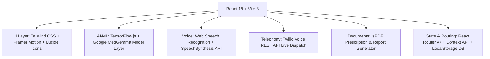

# 🏥 MediSphere — Next-Gen AI Campus Healthcare & Clinical Telemedicine Ecosystem
*An intelligent, unified healthcare management platform empowering campus communities, patients, doctors, and hospital administrators with AI-assisted triage, live emergency dispatch, teleconsultation, and mental wellness tracking.*


## 📌 Overview

**MediSphere** is a modern, full-lifecycle digital healthcare ecosystem tailored for university campuses, hospitals, and clinical networks. It bridges the gap between students, patients, medical practitioners, and emergency response teams by unifying:

1. **AI-Driven Clinical Triage & Specialist Matching** powered by Google MedGemma clinical models.
2. **Instant Emergency SOS with Real-Time Twilio Voice Live Dispatch** to campus response helplines.
3. **Interactive 2D Human Body Map** for intuitive visual symptom localization.
4. **Hands-free Universal Voice Navigation** supporting natural language navigation across 23+ pages in English and Hindi/Hinglish.
5. **Comprehensive Multi-Role Management** (Patients, Doctors, Hospital Admins, Pharmacists, Lab Technicians, and Super Admins).
6. **Campus Mental Wellness & Counseling Hub** featuring standardized PHQ-9 / GAD-7 screening and mood telemetry.

---

## 🚀 Key Features

### 🚨 1. Smart Emergency SOS & Automated Phone Dispatch
- **One-Click Critical SOS:** Triggers an immediate 5-second safety countdown with sound telemetry.
- **Twilio Voice Live Dispatch:** Automatically executes an urgent cellular voice dispatch call to the university medical response team (`+917988766566`) with automated voice briefing.
- **GPS Coordinates & Medical Profile Broadcast:** Transmits real-time geolocation, student ID, blood group, and emergency contact details.

### 🤖 2. MedGemma AI Symptom Checker & Specialist Triage
- **Natural Language Triage:** Patients describe symptoms in plain English or Hinglish (e.g., *"fever and body ache since 2 days"*).
- **Specialist Auto-Filtering:** Matches diagnosed conditions with the most relevant clinical specialist (e.g., General Physician, Pulmonologist, Cardiologist, Dermatologist).
- **Direct Slot Booking:** One-click transition from AI diagnosis to calendar slot selection and instant appointment confirmation.
- **Interactive 2D Body Map:** Clickable anatomical zones (Head, Chest, Abdomen, Spine, Limbs) for non-verbal symptom reporting.

### 🎙️ 3. Universal Voice Assistant & Hands-Free Navigation
- **Multilingual Speech Recognition:** Recognizes natural spoken commands in English, Hindi, and mixed conversational Hinglish.
- **Smart Voice Routing:** Direct redirection to any sub-feature (e.g., *"Redirect to Emergency SOS"*, *"Book doctor appointment"*, *"Check my lab reports"*, *"Open mental health center"*).
- **Voice Clinical Scribe:** Live dictation and transcription inside the doctor's teleconsultation suite.

### 👨‍⚕️ 4. Telemedicine & Virtual Consultation Room
- **High-Definition Video/Audio Calls:** WebRTC-powered virtual doctor visits.
- **Live Clinical Scribing:** Automated speech-to-text for consultation notes and symptoms.
- **Digital E-Prescription Studio:** Doctors generate official digital prescriptions with dosages, schedules, and digital signatures.
- **Instant PDF Export:** Generates high-resolution patient prescription sheets via `jsPDF`.

### 🧠 5. Student Mental Wellness & Confidential Counseling
- **Standardized Screening:** Integrated **PHQ-9** (Depression) and **GAD-7** (Anxiety) clinical questionnaires.
- **Daily Mood Telemetry:** Visual mood logs with contextual sentiment tagging.
- **Counselor Booking:** Confidential 1-on-1 counseling appointment scheduling.
- **Campus Helpline Hotlines:** Direct dial to 24/7 mental wellness helplines (Tele-MANAS, KIRAN).

### 📋 6. University Medical Leave & Certificate Validation
- **Online Medical Leave Application:** Students upload doctor prescriptions and submit leave requests.
- **Automated Verification:** Clinicians and campus authorities review and approve medical leave with timestamped certificates.

---

## 👥 Multi-Portal Ecosystem

MediSphere provides role-based workspaces tailored to each healthcare stakeholder:

| Portal | Key Capabilities |
| :--- | :--- |
| **🧑‍🎓 Patient / Student** | Book appointments, view AI triage, voice navigation, download e-prescriptions, medical leave status, emergency SOS |
| **👨‍⚕️ Doctor / Clinician** | Active patient queue, teleconsultation room, digital prescription pad, diagnostic report review, schedule planner |
| **🏥 Hospital Admin** | Live bed occupancy tracking, ambulance fleet dispatch, emergency logs, staff roster management |
| **💊 Pharmacy** | Digital prescription fulfillment queue, medicine inventory management, stock level alerts |
| **🔬 Diagnostic Lab** | Test order processing, digital lab report upload, diagnostic result delivery to patient records |
| **🛡️ Super Admin** | Campus-wide healthcare analytics, doctor credential verification, audit logs, role access governance |

---

## 🛠️ Tech Stack



- **Frontend Core:** React 19, Vite 8, React Router v7
- **Styling & Motion:** Tailwind CSS, Framer Motion, React Icons (`react-icons`)
- **Machine Learning & AI:** TensorFlow.js (`@tensorflow/tfjs`), MedGemma Medical LLM Prompting & Knowledge Base
- **Emergency Telephony:** Twilio Voice API (`twiml.voice.xml`)
- **Document Generation:** jsPDF
- **Notifications:** React Hot Toast
- **Authentication:** Google OAuth 2.0 (`@react-oauth/google`) + Role-Based Session Provider

---

## 📁 Project Structure

```text
MediSphere/
├── public/                  # Static assets & audio alerts
├── src/
│   ├── assets/              # Logos, illustrations & anatomical body maps
│   ├── components/          # Reusable UI components
│   │   ├── VoiceAssistant.jsx       # Universal voice control & speech navigation
│   │   ├── GlobalQueryBot.jsx       # Floating AI clinical chatbot
│   │   ├── Navbar.jsx               # Dynamic role-based navigation header
│   │   ├── Footer.jsx               # Application footer & emergency contacts
│   │   └── ProtectedRoute.jsx       # Authentication & role guard
│   ├── context/             # Global React contexts (Auth, Emergency, Theme)
│   ├── data/                # Mock databases (Doctors, Appointments, Meds, Labs)
│   ├── pages/               # Application view modules
│   │   ├── BookingPage.jsx          # MedGemma AI specialist triage & appointment booking
│   │   ├── EmergencySOS.jsx         # Live SOS countdown & Twilio voice dispatch
│   │   ├── TeleconsultationPage.jsx # Virtual consultation room with voice scribe
│   │   ├── MentalWellness.jsx       # PHQ-9 / GAD-7 tests & counseling
│   │   ├── PatientDashboard.jsx     # Student/Patient central health hub
│   │   ├── DoctorDashboard.jsx      # Clinician workspace & prescription studio
│   │   ├── HospitalAdmin.jsx        # Bed occupancy & ambulance dispatch
│   │   ├── PharmacyDashboard.jsx    # Drug stock & prescription fulfillment
│   │   ├── LabDashboard.jsx         # Diagnostic reports & test uploads
│   │   └── MedicalLeave.jsx         # Student leave certificate portal
│   ├── services/            # API services (Twilio, MedGemma, Analytics)
│   ├── App.jsx              # Main router & layout configuration
│   └── main.jsx             # React DOM entry point
├── .env.example             # Environment variable template
├── package.json             # NPM dependencies & build scripts
├── vite.config.js           # Vite build & bundler configuration
└── README.md                # Project documentation
```

---

## ⚡ Quick Start

### Prerequisites
- **Node.js**: `v18.0.0` or higher
- **npm** or **yarn**

### Installation

1. **Clone the repository:**
   ```bash
   git clone https://github.com/Tanveer93/MediSphere.git
   cd MediSphere
   ```

2. **Install dependencies:**
   ```bash
   npm install
   ```

3. **Configure Environment Variables:**
   Create a `.env` file in the root directory:
   ```env
   VITE_GOOGLE_CLIENT_ID=your_google_oauth_client_id
   VITE_TWILIO_ACCOUNT_SID=your_twilio_account_sid
   VITE_TWILIO_AUTH_TOKEN=your_twilio_auth_token
   VITE_TWILIO_PHONE_NUMBER=+18167506748
   VITE_EMERGENCY_DISPATCH_NUMBER=+917988766566
   ```

4. **Start the local development server:**
   ```bash
   npm run dev
   ```
   Open `http://localhost:5173` in your browser.

5. **Build for Production:**
   ```bash
   npm run build
   npm run preview
   ```

---

## 🔑 Demo Credentials

For quick testing and evaluation across different portals, use the following pre-configured credentials:

| Role | Username / Email | Password | Target Portal |
| :--- | :--- | :--- | :--- |
| **Patient / Student** | `student@cu.edu` | `patient123` | Patient Dashboard (`/dashboard`) |
| **Doctor / Clinician** | `doctor@cu.edu` | `doctor123` | Doctor Dashboard (`/doctor-dashboard`) |
| **Hospital Admin** | `admin@cu.edu` | `admin123` | Hospital Admin (`/hospital-admin`) |
| **Pharmacist** | `pharmacy@cu.edu` | `pharm123` | Pharmacy Hub (`/pharmacy`) |
| **Lab Technician** | `lab@cu.edu` | `lab123` | Diagnostic Lab (`/lab`) |
| **Super Admin** | `superadmin@cu.edu` | `super123` | System Governance (`/super-admin`) |

---

## 🔒 Security & Privacy

- **HIPAA & Data Privacy Alignment:** Patient identifiable data is protected with scoped session persistence.
- **Confidential Mental Health Logs:** PHQ-9/GAD-7 responses are stored in secure encrypted client records with anonymized option.
- **Emergency Authorization:** SOS voice dispatch requires active token validation to prevent false alarms.

---

## 🤝 Contributing

Contributions are welcome! If you'd like to improve MediSphere:

1. Fork the repository
2. Create your feature branch (`git checkout -b feature/AmazingFeature`)
3. Commit your changes (`git commit -m 'feat: add some AmazingFeature'`)
4. Push to the branch (`git push origin feature/AmazingFeature`)
5. Open a Pull Request

---

## 📜 License

Distributed under the **MIT License**. See `LICENSE` for more information.

---

<div align="center">
  <sub>Built with ❤️ for modern universities and smarter healthcare communities.</sub>
</div>

